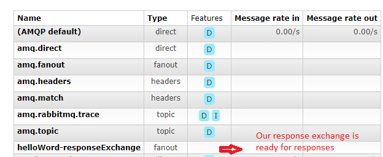
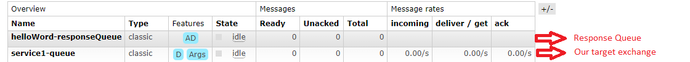
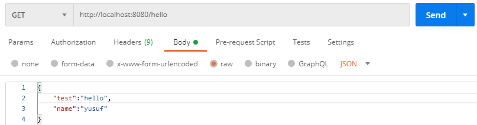
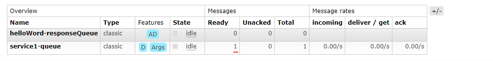
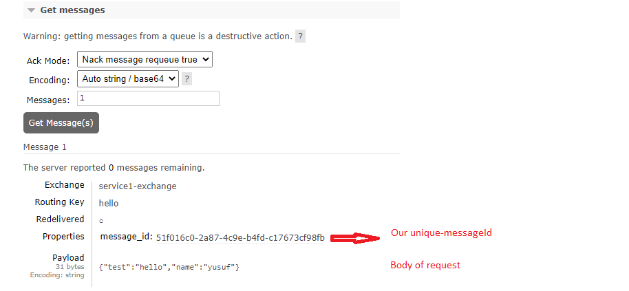
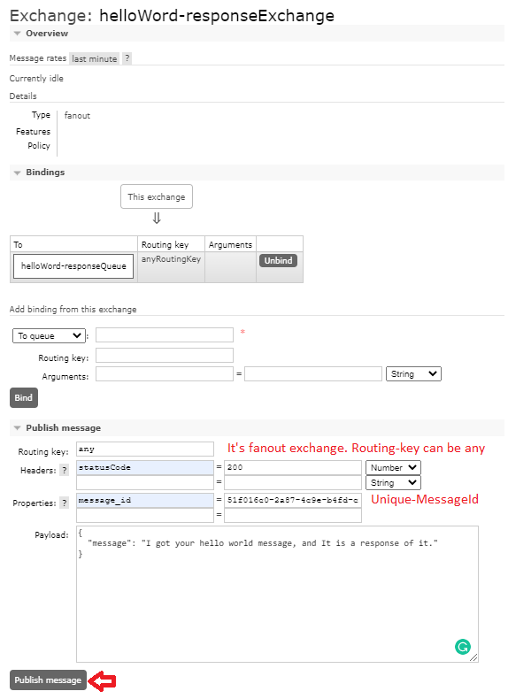
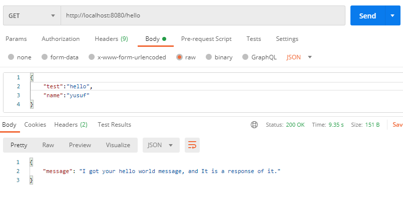

# Rabbitmq-Http Tunnel: Asynchronous Java Http tunnel to Rabbitmq

<a href='https://github.com/ykalay/rabbitmq-http-tunnel/actions/workflows/build_and_deploy.yml'></a>

Rabbitmq Http Tunnel is a Java library for asynchronous and event-based protocol switcher from HTTP to AMQP.

It allows you to use HTTP protocol as asynchronously with AMQP protocol 

#### Version 1.x
- Easy to implement your event-driven architecture with AMQP protocol over HTTP
- Async Http execution with powerful [Netty](https://github.com/netty/netty)  library  
- Powerful Rabbitmq Channel Pooling with [Apache Commons Pool](https://commons.apache.org/proper/commons-pool) for more checkout (RabbitmqChannelStore)
- No additional dependencies (just only rabbitmq-http-tunnel-1.0-jar)
- Netty Epoll support [Netty-Native Transports](https://netty.io/wiki/native-transports.html)
- Ready to use Thread-Model, you don't need to care about the thread-modeling

## Getting started

### Setting up the dependency

The first step is to include Rabbitmq-http-tunnel into your project, for example, as a Maven dependency:

```maven
<dependency>
  <groupId>io.github.ykalay</groupId>
  <artifactId>rabbitmq-http-tunnel</artifactId>
  <version>1.0.4</version>
</dependency>
```
### Hello-World example Rest-Http Controller with Jackson

In this example, we will create hello-world http rest controller with powerful rabbitmq-tunnel library.
The server will get incoming request and send the message to given rabbitmq-exchange with given routing-key
 
Create a controller
```java
        public class RestController implements HttpAmqpTunnelController {
        
            @AmqpTunnelRequestMapper(httpMethod = HttpMethod.GET, path = "/hello")
            public AmqpMessage<JsonNode> helloWorld(TunnelHttpRequest httpRequest) throws Exception {
                ObjectMapper objectMapper = new ObjectMapper();
                JsonNode testModel = objectMapper.readValue(httpRequest.getBody(), JsonNode.class);
                AmqpMessage<JsonNode> request = new AmqpMessage<JsonNode>("hello", "service1-exchange", testModel);
                return request;
            }
        }
```
Firstly, We are creating a HttpAmqpTunnelController. That will send incoming REST request body to the service1-exchange with hello routing-key.

##### Run your server
```java
        RestController restController = new RestController();
        RestController2 anotherHttpController = new RestController2();
        RabbitMqHttpTunnelServerBuilder builder = new RabbitMqHttpTunnelServerBuilder();
        RabbitmqHttpTunnelServer server = builder.setHttpAmqpTunnelControllers(restController, anotherHttpController) // implements HttpAmqpTunnelController
                .setServerPort(8080)
                .setTimeoutSec(50)
                .setServiceName("helloWord") // Service name
                .setRabbitmqConnection(connection) // Your Rabbitmq-server connection instance
                .build();
        server.start(); // And let start the powerful server
```
##### After starting our hello world server the picture of Rabbitmq

Rabbitmq fanout response exchange is created


Our response queue(bound to helloWorld-responseExchange) is created and the target-queue


##### Everything is ready lets test it via Postman

Send a GET request to server



And here we go, Our message is here, Which is going to "service1-exchange" with "hello" routing-key and in example it is routed to service1-queue



Lets consume it manually, and response it manually :). In real world responser will your powerful services :)



We will send the response into our fanout response exchange with uniqueId and statusCode



And that's it :)


##### Don't forget it. These all steps are done by non-blocking from server side. We didn't block any thread until response comes into response-queue. That's why you have to use this library in your scalable-powerful services

### Request Timeout Handing

You can add a timeout handler with "HttpAmqpTunnelTimeoutHandler" into your server and run your own logics for them...

##### Just implement your timeout logic. Example:
```java
        public class TimeoutHandler implements HttpAmqpTunnelTimeoutHandler {
            @Override
            public TunnelHttpResponse handleTimeout(AmqpMessage amqpMessage, String s) {
                TunnelHttpResponse tunnelHttpResponse = new TunnelHttpResponse();
                tunnelHttpResponse.setBody("YOUR_TIMEOUT_BODY".getBytes());
                tunnelHttpResponse.setHttpResponseStatus(HttpResponseStatus.REQUEST_TIMEOUT);
                return tunnelHttpResponse;
            }
        }
```

Add it into your server builder with "setHttpAmqpTunnelTimeoutHandler"
```java
        RestController restController = new RestController();
        RestController2 anotherHttpController = new RestController2();

        TimeoutHandler timeoutHandler = new TimeoutHandler();

        RabbitMqHttpTunnelServerBuilder builder = new RabbitMqHttpTunnelServerBuilder();
        RabbitmqHttpTunnelServer server = builder.setHttpAmqpTunnelControllers(restController, anotherHttpController) // implements HttpAmqpTunnelController
                .setHttpAmqpTunnelTimeoutHandler(timeoutHandler)
                .setTimeoutSec(50)
                .
                .
                .build();
        server.start();
```

### Request Exception Handing

You can easily implement your exception advices via "TunnelExceptionAdviser" interface

##### Just implement your exception adviser logic with TunnelExceptionAdviser. Example:
```java
        public class ExceptionAdviser implements TunnelExceptionAdviser {
            @Override
            public TunnelHttpResponse handleException(TunnelHttpRequest tunnelHttpRequest, Throwable throwable) {
                TunnelHttpResponse tunnelHttpResponse = new TunnelHttpResponse();
                tunnelHttpResponse.setBody("Test-exception-response".getBytes());
                tunnelHttpResponse.setHttpResponseStatus(HttpResponseStatus.NOT_FOUND);
                return tunnelHttpResponse;
            }
        }
```
Add it into your server builder with "setHttpAmqpTunnelTimeoutHandler"
```java
        RestController restController = new RestController();
        RestController2 anotherHttpController = new RestController2();

        ExceptionAdviser exceptionAdviser = new ExceptionAdviser();

        RabbitMqHttpTunnelServerBuilder builder = new RabbitMqHttpTunnelServerBuilder();
        RabbitmqHttpTunnelServer server = builder.setHttpAmqpTunnelControllers(restController, anotherHttpController) // implements HttpAmqpTunnelController
                .setTunnelExceptionAdviser(timeoutHandler)
                .
                .
                .build();
        server.start();
```

This library is developed by ([@ykalay](https://github.com/ykalay)) and venga-developer team. More info about ([Venga](http://vengapp.com/))